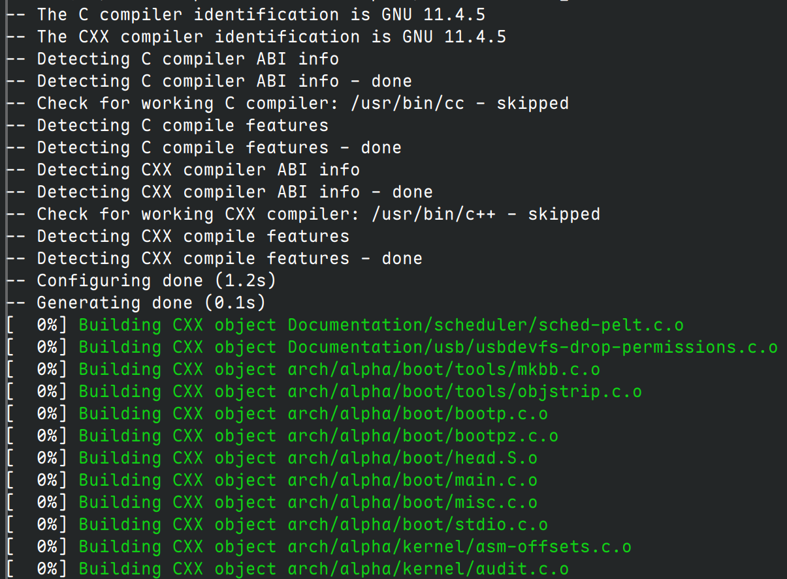
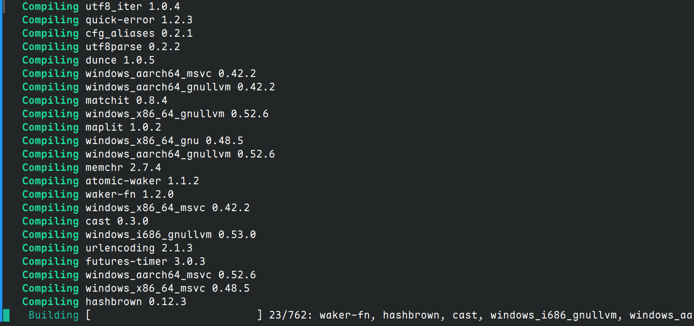

# Fake Compiler

Pretend as if something is compiling or busying in your terminal.

## Usage

### Run compiler: `run` subcommand

Run over a directory: `fake-compiler run -d path_to_compile -C compiler_type`
  - `-C` option: specify the compiler type, i,e how `fake-compiler` interprets the given directory `path_to_compile`
  - Supported compiler type: `cxx` and `cargo`
    - `cxx`: `fake-compiler` will iterate through the whole directory and print cmake style compiling logs of all files with `.cpp/.c/.S` extension
    - `cargo`: `fake-compiler` will parse `Cargo.toml` and `Cargo.lock` within directory root, resolving dependency graph and printing cargo style compiling logs

Or run with a config file: `fake-compiler run -c config_file`
  - The config file contains parsed result of some directory. It has specific format, you should generate it by `gen` subcommand
  - Actually it is equivalent to `-d` option, except that `fake-compiler` now no longer needs to explicitly parse the directory everytime

Optional flag: `-t threads`: specify the number of threads, default: 16
  - Since `fake-compiler` does not actually do the compiling stuff, this flag essentially specifies how many threads are sleeping at the same time

Optional flag: `-p bar`: specify the style of progress bar/compiling logs
  - YES, you can specify this. Each compiler has its own default progress bar, but you can explicitly specify others
  - Supported progress bar: same as supported compiler type, i,e `cxx` and `cargo`
  - This option only affects how the interpreted content is printed, it does not affect how to interpret the given directory

### Generate config file: `gen` subcommand
You can generate config file by `fake-compiler gen -C compiler_type -d path_to_compile -o output_file`
  - The generated file is bound to how specified compiler interprets the directory

## Example config files
This repository is shipped with two example config files, placed at `examples/` directory:
 - `examples/linux-6.12.17_cxx`: linux 6.12.17 source code
 - `examples/router_cargo`: [Apollo Router Core](https://github.com/apollographql/router)

Try it out (need Go environment): `go run . run -c examples/linux-6.12.17_cxx`

## Build

1. Setup Go environment, minimal version required: 1.22
2. Run `make build` 